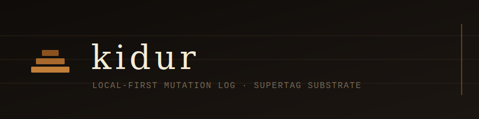

<p align="center">
  
</p>

<p align="center">
  <strong>The (aspired) universal backend for text &amp; canvas</strong><br/>
  Open infrastructure for inter-connecting knowledge systems ·
  <em>Kidur (𒆳𒁺) — earth-settled, foundation — Sumerian</em>
</p>

<p align="center">
  <a href="LICENSE"></a>
  <a href="LICENSE-ENTERPRISE"></a>
  
  
</p>

---

## What it is

Kidur stores typed outline nodes in an **append-only `.jsonl` mutation log**. The log is canonical — the ground. An in-memory index is rebuilt from it on startup.

Nodes carry an optional **supertag** — a TOML-defined schema with named, typed fields (the Tana model as an open standard). Field values are validated at write time. No database required.

## Crates

| Crate | Purpose |
|-------|---------|
| `kidur-core` | `Node`, `Edge`, `FieldValue`, `SupertagDef` — pure types, zero deps |
| `kidur-supertag` | TOML supertag loader + field validator |
| `kidur-crdt` | Loro CRDT wrapper — movable tree + text snapshots |
| `kidur-log` | Append-only `.jsonl` mutation log |
| `kidur-cli` | `kidur` binary — init, add, list |

## Quick start

```bash
cargo build -p kidur-cli

# Initialize a data directory
kidur --data-dir ./data init

# Add a node
kidur --data-dir ./data add "Rebuild the onboarding flow" \
  --type quest \
  --field status=active \
  --field priority=high \
  --field privacy_tier=public

# List nodes
kidur --data-dir ./data list --type quest
```

Set `KIDUR_DATA=./data` once to omit `--data-dir` on every call.

## Data format

Each write appends one JSON line to `kidur.jsonl`:

```json
{"seq":1,"ts":"2026-04-14T12:00:00Z","op":"create_node","node":{...}}
```

The log is human-readable, diffable, and trivially backed up with `rsync` or `git`.

## Supertags

Supertags are TOML files defining typed schemas. `kidur init` writes the bundled defaults to `./supertags/`:

| Supertag | Description |
|----------|-------------|
| `quest` | Project, initiative, or goal |
| `person` | Person entity |
| `document` | PDF or scanned document |
| `handwritten_note` | Scanned handwritten page |
| `drawing` | Visual content from scan |
| `email` | Parsed email message |

Drop a `.toml` file into your supertags directory to add your own.

## Integrating as a library

```toml
[dependencies]
kidur-core     = { git = "https://github.com/Kidur/kidur" }
kidur-log      = { git = "https://github.com/Kidur/kidur" }
kidur-supertag = { git = "https://github.com/Kidur/kidur" }
```

## License

Dual-licensed:

- **[AGPL-3.0](LICENSE)** — free for bootstrapped and self-funded organizations
- **[Enterprise](LICENSE-ENTERPRISE)** — required for organizations that have received external investment · pricing TBD · [connect@evobiosys.org](mailto:connect@evobiosys.org)

---

<sub>Initial implementation developed with <a href="https://claude.ai/code">Claude Code</a>.</sub>
